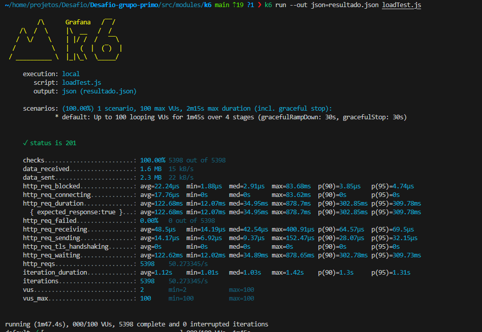

# Desafio API Transações

Este é um projeto de API de um sistema bancário desenvolvido com NestJS e Sequelize, projetado para gerenciar transações bancárias, incluindo depósito, saque e transferência entre contas. Ele suporta múltiplas transações concorrentes, garantindo a integridade do saldo das contas.

## Pré-requisitos

Antes de começar, você precisa ter instalado:

- [Node.js](https://nodejs.org/en/download/)
- [MySQL](https://dev.mysql.com/downloads/installer/)
- [Git](https://git-scm.com/downloads)

## Instalação

Siga os passos abaixo para configurar o projeto localmente:

### 1. Clone o repositório

Abra o terminal e execute o comando:

```bash
git clone https://github.com/Douglas-00/Desafio-grupo-primo.git
```

### 2. Navegue até o diretório do projeto

```bash
cd seu-repositorio
```

### 3. Instale as dependências

Use o npm para instalar as dependências do projeto:

```bash
npm install

```

### 4. Configure o banco de dados

1. Crie um banco de dados no MySQL chamado `desafio` ou nome que preferir, só tem que estar na variavel.
2. Crie um arquivo .env na raiz do projeto com as configurações do banco de dados:

```bash

DB_HOST=localhost
DB_PORT=3306
DB_USERNAME=usuario
DB_PASSWORD=senha
DB_NAME=desafio
```

Substitua `usuario`, `senha` e `desafio` pelas informações correspondentes ao seu banco de dados MySQL.

### 5. Configurar Models do Sequelize

Este projeto utiliza Sequelize apenas para definir os models, sem migrações automatizadas. Certifique-se de que os models representam corretamente a estrutura de tabelas no banco de dados.

1. Execute o servidor para que o Sequelize sincronize automaticamente as tabelas com base nos models.

Isso criará a estrutura inicial das tabelas no banco de dados.

### 6. Iniciar o Servidor

```bash
npm run start
```

A API estará rodando em [http://localhost:3000](http://localhost:3000).

## Rota da API

Esta API possui uma única rota para gerenciar tanto a criação de contas quanto a execução de transações.

### 1. Gerenciar Contas e Transações

- **Endpoint**: `POST /account`
- **Exemplo de Requisição**:

  ```json
  {
    "accounts": [
      {
        "number": 1,
        "balance": 500
      },
      {
        "number": 2,
        "balance": 1000
      }
    ],
    "transactions": [
      {
        "accountId": 1,
        "type": "TRANSFER",
        "amount": 100,
        "destinyId": 2
      },
      {
        "accountId": 1,
        "type": "DEPOSIT",
        "amount": 350
      },
      {
        "accountId": 1,
        "type": "WITHDRAW",
        "amount": 20
      }
    ]
  }
  ```

- **Resposta Esperada**:
  ```json
  {
    "message": "Accounts and transactions processed successfully!"
  }
  ```

### Testes de Concorrência

Para simular transações concorrentes, você pode usar ferramentas como [Postman], criei um teste com o K6.

## O teste é garantindo que as contas já estão criadas. (o accountId é o number da conta).

```bash
  import http from 'k6/http';
  import { check, sleep } from 'k6';

  export let options = {
    stages: [
      { duration: '30s', target: 50 },
      { duration: '15s', target: 100 },
      { duration: '15s', target: 100 },
      { duration: '5s', target: 0 },
    ],
  };

  export default function () {
    let payload = JSON.stringify({
      //accountId = number da conta.
      accounts: [],
      transactions: [
        // Initial transactions
        { accountId: 1, type: 'DEPOSIT', amount: 100 },
        { accountId: 1, type: 'WITHDRAW', amount: 50 },
        { accountId: 1, type: 'TRANSFER', amount: 30, destinyId: 2 },

        // Concorrência 1
        { accountId: 1, type: 'DEPOSIT', amount: 50 },
        { accountId: 1, type: 'WITHDRAW', amount: 30 },

        // Concorrência 2
        { accountId: 1, type: 'DEPOSIT', amount: 100 },
        { accountId: 1, type: 'TRANSFER', amount: 50, destinyId: 2 },
        // Concorrência 3
        { accountId: 1, type: 'TRANSFER', amount: 20, destinyId: 2 },
        { accountId: 2, type: 'TRANSFER', amount: 10, destinyId: 3 },
      ],
    });

    let res = http.post('http://localhost:3000/account', payload, {
      headers: { 'Content-Type': 'application/json' },
    });

    check(res, {
      'status is 201': (r) => r.status === 201,
    });

    sleep(1);
  }
```



## Ferramentas e Tecnologias Utilizadas

- **NestJS**: Framework para construção de aplicações Node.js escaláveis.
- **Sequelize**: ORM moderno para interagir com o banco de dados.
- **MySQL**: Banco de dados relacional.
- **TypeScript**: Superset do JavaScript para desenvolvimento com tipagem estática.

## Contato

- Email: alvesdouglas547@gmail.com
- GitHub: [Douglas-00]
